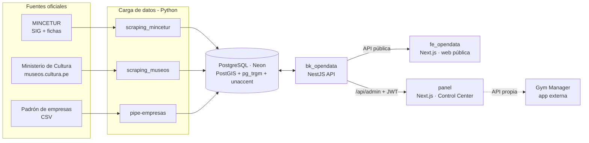

# OpenData Perú

Plataforma de **datos abiertos del Perú** que reúne, normaliza y publica información oficial de turismo, museos y empresas en un solo lugar, con una web pública optimizada para buscadores y un panel de administración para gestionar el contenido.

🌐 **Sitio público:** [opendata.pukio.lat](https://opendata.pukio.lat) · Desarrollado por **PUKIO**

---

## Índice

1. [¿Qué es OpenData Perú?](#qué-es-opendata-perú)
2. [Fuentes de datos](#fuentes-de-datos)
3. [Arquitectura](#arquitectura)
4. [Estructura del repositorio](#estructura-del-repositorio)
5. [Componentes](#componentes)
   - [Web pública — `fe_opendata`](#web-pública--fe_opendata)
   - [API — `bk_opendata`](#api--bk_opendata)
   - [Panel de administración — `panel`](#panel-de-administración--panel)
   - [Procesos de carga de datos](#procesos-de-carga-de-datos)
6. [Base de datos](#base-de-datos)
7. [Instalación y ejecución local](#instalación-y-ejecución-local)
8. [Variables de entorno](#variables-de-entorno)
9. [Migraciones de base de datos](#migraciones-de-base-de-datos)
10. [Despliegue](#despliegue)
11. [Cosas a tener en cuenta](#cosas-a-tener-en-cuenta)

---

## ¿Qué es OpenData Perú?

La información pública del Perú existe, pero está **dispersa** en portales distintos, en formatos difíciles de consultar y, muchas veces, sin buscador ni mapa. OpenData Perú la recopila desde las fuentes oficiales, la limpia y la expone de tres formas:

| Para quién | Qué ofrece |
|---|---|
| **Viajeros y público general** | Una web con buscador, filtros, mapas y fichas detalladas de atractivos turísticos, museos y empresas. |
| **Emprendedores, investigadores, periodistas** | Datos estructurados y consultables vía API, con estadísticas por región y categoría. |
| **El equipo de PUKIO** | Un panel (*Control Center*) para crear, corregir y enriquecer los datos (SEO, descripciones, estado) y publicar artículos. |

### Lo que se puede consultar

- **Turismo:** inventario oficial de recursos turísticos de MINCETUR (≈2,300 activos), con categoría, jerarquía (1–4), ubicación, coordenadas, fotos y ficha técnica.
- **Museos:** red nacional de museos del Ministerio de Cultura y museos públicos y privados (≈86), con horarios, tarifas, servicios, galería y recorridos virtuales 360°.
- **Empresas:** directorio de contribuyentes (≈32,100) con RUC, razón social, estado, condición del domicilio (habido/no habido), actividad económica (CIIU) y ubicación.
- **Blog:** guías y análisis elaborados con los propios datos de la plataforma.
- **Ruta del Papa León XIV:** cronograma y mapa de la visita papal por regiones.

> Las cifras son aproximadas a octubre de 2026 y cambian con cada actualización de las fuentes.

---

## Fuentes de datos

| Dominio | Fuente oficial | Cómo se obtiene | Tabla principal |
|---|---|---|---|
| Recursos turísticos | **MINCETUR** — SIG de Turismo y fichas del Inventario Nacional de Recursos Turísticos | Scraper Python (`scraping_mincetur`) | `turismo.recursos` |
| Museos | **Ministerio de Cultura** — [museos.cultura.pe](https://museos.cultura.pe) | Scraper Python (`scraping_museos`) | `museos.museos` |
| Empresas | Padrón de contribuyentes (CSV) | Carga Python (`pipe-empresas`) | `empresas.empresas` |
| Ubigeo | INEI (departamentos, provincias, distritos) | Incluido en el scraper de MINCETUR | `turismo.departamentos/provincias/distritos` |
| Blog y usuarios | Propios | Panel de administración | `public.blog_posts`, `public.users` |

---

## Arquitectura



- Los **procesos Python** escriben directamente en PostgreSQL mediante *upserts*.
- **`bk_opendata`** es la única puerta de entrada a la base de datos para las aplicaciones web: expone una API pública de solo lectura y una API de administración protegida con JWT.
- **`fe_opendata`** consume la API pública y genera páginas indexables (SEO, sitemap, datos estructurados).
- **`panel`** consume la API de administración y, además, gestiona otras apps de PUKIO (por ahora *Gym Manager*).

---

## Estructura del repositorio

```text
opendata/
├── fe_opendata/         # Web pública (Next.js 14 · App Router · Tailwind 3)
├── bk_opendata/         # API (NestJS 10 · Prisma 5 · PostgreSQL)
│   ├── src/
│   │   ├── mincetur/    # API pública de recursos turísticos
│   │   ├── museos/      # API pública de museos
│   │   ├── empresas/    # API pública de empresas
│   │   ├── papa/        # API de la Ruta del Papa
│   │   ├── blog/        # API pública del blog
│   │   ├── auth/        # Login JWT, guards por app y por rol
│   │   └── admin/       # API de administración (places, museums, companies, posts, users)
│   └── prisma/
│       ├── schema.prisma
│       ├── seed.ts      # Crea el usuario administrador inicial
│       └── sql/         # Migraciones SQL manuales (ver más abajo)
├── panel/               # Control Center (Next.js 16 · React 19 · Tailwind 4)
├── scraping_mincetur/   # Scraper de MINCETUR → PostgreSQL / JSON
├── scraping_museos/     # Scraper de museos.cultura.pe → PostgreSQL / JSON
├── pipe-empresas/       # Carga del padrón de empresas (CSV) → PostgreSQL
├── example/             # Documentación y ejemplo de uso de la API de MINCETUR
└── tests/               # Prototipo de mapa por distritos (Leaflet + GeoJSON)
```

---

## Componentes

### Web pública — `fe_opendata`

Next.js 14 (App Router), Tailwind CSS, Leaflet y `next-view-transitions`.

| Ruta | Contenido |
|---|---|
| `/` | Portada con buscador, destinos destacados y mapa del Perú por regiones. |
| `/turismo` · `/turismo/[slug]` | Listado filtrable (región, categoría, jerarquía) y ficha de cada recurso con mapa, fotos, accesos y época de visita. |
| `/museos` · `/museos/[slug]` | Directorio de museos con filtros, mapa, horarios, tarifas, servicios y recorridos 360°. |
| `/empresas` · `/empresas/[slug]` | Buscador por razón social o RUC, filtros por región y tipo, y ficha de cada contribuyente. |
| `/blog` · `/blog/[slug]` | Artículos publicados desde el panel (renderizado en servidor, Markdown seguro). |
| `/ruta-del-papa` | Cronograma y mapa de la visita del Papa León XIV. |
| `/politicas-de-privacidad`, `/terminos-y-condiciones` | Páginas legales. |

**Características:**

- **SEO:** metadatos por página, *canonical*, Open Graph, JSON-LD (`DataCatalog`, `BlogPosting`, etc.) y un `sitemap.xml` dinámico con miles de URLs (recursos, museos, empresas, hubs por región/categoría y blog). Incluye catálogos de respaldo en `src/data/*-sitemap.json` por si la API no responde durante el build.
- **Idiomas:** español, inglés y quechua (`ES` / `EN` / `QU`).
- **Tema claro y oscuro.**
- **Analítica y monetización:** Google Analytics (`NEXT_PUBLIC_GA_ID`) y banners de Adsterra.

### API — `bk_opendata`

NestJS 10 + Prisma 5. Prisma se usa para los modelos propios (usuarios, blog, apps) y para **consultas SQL directas** sobre los esquemas `turismo`, `museos` y `empresas`; los módulos públicos usan además un pool de `pg`.

**API pública** (sin autenticación):

| Prefijo | Endpoints principales |
|---|---|
| `/api` (MINCETUR) | `GET /resources`, `/resources/:codFicha`, `/resources/all`, `/resources/featured`, `/categories`, `/activities`, `/departments`, `/departments/:iddpto/resources`, `/map/resources`, `/map/geojson`, `/photos/:cod`, `/health` |
| `/api/museos` | `GET /`, `/:slug`, `/departments`, `/categories`, `/services`, `/stats`, `/featured`, `/map/geojson`, `/sitemap` |
| `/api/empresas` | `GET /`, `/:idOrSlug`, `/ruc/:ruc`, `/slug/:slug`, `/suggest`, `/stats`, `/catalogs`, `/sitemap` |
| `/api/blog` | `GET /` (publicados, paginado), `/:slug` (+ 3 relacionados), `/sitemap` |
| `/api` (Papa) | `GET /papa-leon-xiv`, `/ruta-papa` |

**Autenticación** (`/api/auth`): `POST /login` → JWT, `GET /me`, `PATCH /me/password`.

**API de administración** (`/api/admin/*`, requiere `Authorization: Bearer <token>`):

| Recurso | Tabla | Operaciones |
|---|---|---|
| `places` | `turismo.recursos` | CRUD + `GET /options` (categorías, regiones) y `GET /ubigeo?parent=` (provincias/distritos) |
| `museums` | `museos.museos` | CRUD + `GET /options` |
| `companies` | `empresas.empresas` | CRUD + `GET /options` y `GET /ciiu?search=` |
| `posts` | `public.blog_posts` | CRUD |
| `users` | `public.users` | Listar, crear, editar y asignar apps (solo superadmin) |

**Seguridad y rendimiento:** `helmet`, compresión gzip, CORS configurable, `ValidationPipe` global (whitelist), *rate limiting* (1,200 req/min por IP) y registro de cada petición HTTP.

**Control de acceso:**

- `JwtAuthGuard` valida el token y que el usuario siga existiendo y activo.
- `AppAccessGuard` restringe cada módulo a los usuarios con acceso a esa app del panel.
- `SuperadminGuard` protege la gestión de usuarios.
- Rol `ADMIN` = superadministrador (acceso a todas las apps); `EDITOR` = solo las apps asignadas en `user_apps`.

### Panel de administración — `panel`

*Control Center* en Next.js 16 + React 19 + Tailwind 4, con diseño inspirado en Vercel/Geist. Es **multiaplicación**: cada app se registra en `panel/lib/apps.ts` y el selector, el menú, el buscador `Ctrl K` y el botón **+ Crear** se construyen a partir de ese registro.

| App | Secciones |
|---|---|
| **OpenData Perú** | Resumen · Turismo · Museos · Empresas · Blog / Artículos |
| **Gym Manager** | Resumen · Empresas · Planes (consume la API de la app de gimnasios, `NEXT_PUBLIC_GYM_APP_URL`) |
| **Configuración** | Usuarios (solo superadmin) · Mi cuenta |

**Funcionalidades:**

- Listados con búsqueda, filtros, contadores, paginación y **selector de columnas visibles** que se recuerda por navegador.
- Formularios de alta y edición con validación, selector en cascada Región → Provincia → Distrito (ubigeo), buscador de actividades CIIU y sección SEO (slug, meta title, meta description, keywords).
- Estado unificado **Activo / Inactivo** en todos los catálogos.
- Indicador de **origen** de cada registro (importado o manual) y avisos cuando se edita un dato que el proceso de carga sobrescribirá.
- Gestión de usuarios con asignación de apps y cambio de contraseña.

Componentes reutilizables en `panel/components/ui` (botones, inputs, selects, tablas, badges, modales, toasts…) y hooks en `panel/lib/hooks`.

### Procesos de carga de datos

#### `scraping_mincetur`

Extrae el inventario turístico desde el GeoServer y las fichas técnicas de MINCETUR: catálogos (categorías, tipos, subtipos, actividades), ubigeo, recursos con coordenadas y fichas completas (descripción, accesos, época de visita, fotos, videos). Es concurrente, con *checkpoints* para reanudar y registro de fichas dadas de baja.

```bash
cd scraping_mincetur
pip install -r requirements.txt
python main.py -all            # Todo → PostgreSQL
python main.py -all json       # Todo → archivos JSON
python main.py -recursos       # Solo recursos
python main.py -fichas         # Solo fichas técnicas
python main.py -ficha 100      # Una ficha
python main.py -stats
```

#### `scraping_museos`

Rastrea [museos.cultura.pe](https://museos.cultura.pe) (museos del Ministerio de Cultura y públicos/privados): ubicación, geolocalización, reseña, horarios, tarifas, servicios, galería y enlaces virtuales.

```bash
cd scraping_museos
pip install -r requirements.txt
python main.py -init-db        # Crea el esquema museos
python main.py -all            # Todo → PostgreSQL (añade "json" para exportar)
python main.py -museo museo-de-sitio-pachacamac
```

#### `pipe-empresas`

Lee el padrón `empresas.csv`, traduce las columnas al español, limpia fechas y nulos, registra los catálogos (CIIU y tipos de contribuyente) e inserta por lotes con *upsert* por RUC.

```bash
cd pipe-empresas
pip install -r requirements.txt
python cargar_db.py            # Usa DATABASE_URL del entorno o de bk_opendata/.env
```

---

## Base de datos

PostgreSQL alojado en **Neon**, con las extensiones `postgis`, `pg_trgm` y `unaccent`.

| Esquema | Contenido | Cargado por |
|---|---|---|
| `turismo` | `recursos`, `categorias`, `tipos_categoria`, `subtipos_categoria`, `actividades`, `ficha_*`, `departamentos`, `provincias`, `distritos`, `fichas_offline` y vistas (`vw_recursos_resumen`, …) | `scraping_mincetur` |
| `museos` | `museos`, `museo_servicios`, `museo_tarifas`, `museo_fotos`, `servicios_catalogo` y vistas (`v_museos_listado`, `v_museos_geojson`, …) | `scraping_museos` |
| `empresas` | `empresas`, `actividades_ciiu`, `tipos_contribuyente` y vistas (`vw_empresas_resumen`, …) | `pipe-empresas` |
| `public` | `users`, `panel_apps`, `user_apps`, `blog_posts` (modelos Prisma) | `bk_opendata` / panel |

**Detalles importantes:**

- Las columnas `geom` son de PostGIS y **se calculan solas** a partir de latitud y longitud (columna generada o trigger). Nunca se escriben a mano.
- La búsqueda sin tildes usa `turismo.f_unaccent` con índices trigram.
- Los registros tienen una columna **`origen`**:
  - `mincetur` o `importado`: vienen de los procesos de carga.
  - `manual`: se crearon desde el panel y usan rangos de ID propios para no chocar con las fuentes. En `turismo.recursos` el código empieza en 900001; en `empresas.empresas`, en 9,000,000,000.

Los DDL de referencia están en `scraping_mincetur/db/opendata.sql`, `scraping_museos/db/museos.sql` y `bk_opendata/db/`.

---

## Instalación y ejecución local

### Requisitos

- Node.js 20 o superior y npm.
- Python 3.10 o superior (solo para los procesos de carga).
- Una base PostgreSQL con PostGIS (por ejemplo, Neon).

### Pasos

```bash
# 1. API
cd bk_opendata
npm install                    # genera el cliente de Prisma automáticamente
npm run start:dev              # http://localhost:3001

# 2. Web pública
cd fe_opendata
npm install
npm run dev                    # http://localhost:3000

# 3. Panel (en otro puerto si la web pública ya usa el 3000)
cd panel
npm install
npm run dev -- -p 3100         # http://localhost:3100
```

Para crear el primer usuario administrador, define `INITIAL_ADMIN_EMAIL` e `INITIAL_ADMIN_PASSWORD` en `bk_opendata/.env` y ejecuta:

```bash
cd bk_opendata
npm run prisma:seed
```

---

## Variables de entorno

Los archivos `.env` **no se versionan**.

### `bk_opendata/.env`

| Variable | Descripción |
|---|---|
| `DATABASE_URL` | Cadena de conexión PostgreSQL (Neon). |
| `JWT_SECRET` | Secreto para firmar los tokens del panel. |
| `JWT_EXPIRES_IN` | Duración del token (por ejemplo, `7d`). |
| `CORS_ORIGIN` | Orígenes permitidos separados por coma (web pública y panel), o `*`. |
| `PORT` | Puerto local (por defecto `3001`). |
| `INITIAL_ADMIN_EMAIL` · `INITIAL_ADMIN_PASSWORD` | Usuario que crea el `seed`. |

### `fe_opendata/.env.local`

| Variable | Descripción |
|---|---|
| `NEXT_PUBLIC_API_URL` | URL de la API **incluyendo `/api`** (por ejemplo, `http://localhost:3001/api`). |
| `NEXT_PUBLIC_SITE_URL` | URL pública del sitio (canonical y sitemap). |
| `NEXT_PUBLIC_GA_ID` | ID de Google Analytics (opcional). |

### `panel/.env.local`

| Variable | Descripción |
|---|---|
| `NEXT_PUBLIC_API_URL` | URL base de la API **sin `/api`** (por ejemplo, `http://localhost:3001`). |
| `NEXT_PUBLIC_GYM_APP_URL` | URL de la app Gym Manager. |

Los procesos Python leen `DATABASE_URL` del entorno o de `bk_opendata/.env`.

---

## Migraciones de base de datos

> ⚠️ **No uses `prisma db push` ni `prisma migrate dev` contra la base de producción.** Esos comandos intentan que la base quede idéntica a `schema.prisma`, y los esquemas `turismo`, `museos` y `empresas` no están en él. Podrían proponer borrar tablas con decenas de miles de registros.

Los cambios de esquema se hacen con **scripts SQL aditivos e idempotentes** en `bk_opendata/prisma/sql/`:

| Script | Qué hace |
|---|---|
| `001_init_admin_tables.sql` | Crea `users`, `tourist_places` y `blog_posts` (modelos Prisma). |
| `002_recursos_admin_seo.sql` | Añade slug, SEO y `origen` a `turismo.recursos`, la secuencia de códigos manuales y un trigger de slug. |
| `003_empresas_museos_origen.sql` | Añade `origen` a empresas y museos, y la secuencia de IDs manuales de empresas. |

Para aplicar uno nuevo:

```bash
cd bk_opendata
npx prisma db execute --file prisma/sql/00X_nombre.sql --schema prisma/schema.prisma
```

Para ver qué cambiaría el schema de Prisma sin aplicar nada:

```bash
npx prisma migrate diff --from-url "$DATABASE_URL" --to-schema-datamodel prisma/schema.prisma --script
```

---

## Despliegue

| Proyecto | Plataforma | Notas |
|---|---|---|
| `bk_opendata` | Vercel (NestJS) o un servidor con PM2 (`ecosystem.config.js`) | El build ejecuta `prisma generate` y existe un `postinstall`, necesario por la caché de dependencias de Vercel. `binaryTargets` incluye `rhel-openssl-3.0.x`. |
| `fe_opendata` | Vercel | Páginas con ISR. El blog se revalida cada 5 minutos y el sitemap cada día. |
| `panel` | Vercel | Añade su URL a `CORS_ORIGIN` del backend. |
| Procesos de carga | Manual o tarea programada | Ejecutar periódicamente para refrescar los datos. |

Configura las variables de entorno de cada proyecto en su plataforma: en Vercel, **Settings → Environment Variables**.

---

## Cosas a tener en cuenta

- **Los procesos de carga sobrescriben datos.** Al volver a ejecutarlos, los campos de origen (nombre, ubicación, categoría, etc.) de los registros importados se actualizan desde la fuente. Lo que se edita en el panel y **sí se conserva**:
  - **Turismo:** slug, SEO y descripción.
  - **Empresas:** teléfono, correo, web, representante y estado activo.
  - **Museos:** solo el estado activo.

  El panel avisa al editar un campo que se perderá.
- **Turismo y el estado activo.** El scraper de MINCETUR vuelve a marcar como activos sus recursos en cada carga, así que desactivar un recurso de MINCETUR no es permanente.
- **Los registros importados no se borran desde el panel**: la siguiente carga los volvería a crear. En su lugar se desactivan. Los registros manuales sí pueden eliminarse.
- **Booleanos en query strings.** En los DTO usa el decorador `QueryBoolean()` (`bk_opendata/src/admin/shared`). Con `enableImplicitConversion`, `"false"` se convertiría en `true`.
